# Резюме и портфолио

## Общая информация

👱‍ Станислав  
📆 31 год  
🌍 Россия, Ярославль  
💻 10 лет коммерческой разработки: 2 года fullstack-разработчиком в офисе, 8 лет – фронтендером удалённо.

## Карьера

🏢 **ООО «Веб Сервис»** _сентябрь 2014 – август 2016_  
💼 **Fullstack-разработчик**  
💻 Поддержка интернет-аптеки piluli.ru (сейчас – eapteka.ru), разработка сайтов и форумов  
⚙️ PHP, MySQL, JS, jQuery, Backbone.js, Wordpress, IP.Board, Elastic Search, Python  

🏢 **Фриланс** _август 2016 – октябрь 2016_  
💼 **Фрилансер на fl.ru**  
💻 Разработка сайтов  
⚙️ Wordpress и AngularJS (v1)  

🏢 **Openlect LLC** _октябрь 2016 – декабрь 2020_  
💼 **Дизайнер и frontend-разработчик на удалёнке**  
💻 Работал над продуктом Textlake  
⚙️ Typescript, Webpack, Angular 2-11, Socket.IO, GSAP

🏢 **AETolls LLC (сейчас – NeoRide Inc.)** _январь 2021 – февраль 2024_  
💼 **Дизайнер и frontend-разработчик на удалёнке**  
💻 Работал над продуктом TapNPay  
⚙️ Typescript, Webpack, Angular 11-17, D3, Jest

## Опыт в технологиях

* **Хороший:** JS (ES5-ES2024), TS, Angular 2-17 (Ivy, Standalone Components, Signals), ngx-translate, Jest, Bootstrap, GSAP, Lottie, jQuery, Webpack, Vite, Gulp, Python, PHP, MySQL, Chrome Extensions, разные Web APIs, REST API, Git, Bitbucket, Jira, Trello, Мегаплан.
* **Базовый:** NgRx, RxJs, Angular Material, React, Redux, Redux Toolkit, Zustand, Cypress, Node.js, D3, Three.js, WebGL2, компьютерная графика и математика, Rust, C/C++, C#.
* **Нет:** GraphQL, Vue, NgXs, Tailwind, Storybook, Playwright, CI/CD.

💡 Помните, что я всегда готов учиться новому.

## Качества

* Пунктуальный
* Исполнительный
* Самостоятельный
* Всегда на связи
* Быстро учусь
* Перфекционист в рамках разумного

## Портфолио


☝ В этом репозитории представлены мои хобби-проекты и урезанные исходники некоторых коммерческих проектов, над которыми я работал в разных компаниях.  

👇 Ниже краткое описание каждого из этих проектов.


<br>

##  [BinTools](projects/00_bin-tools) <sup><sub>хобби</sub></sup>

📝 Моя новая библиотека для чтения и записи бинарных файлов в браузере или Node.js.  
⚙️ **Typescript 5**, **Webpack**, **Jest**.  
💡  Полностью готова, почти целиком покрыта юнит-тестами на Jest, _пока_ нет документации. Когда доделаю, опубликую в npm.


**Пример использования:**
```ts
import { BinBuffer, EBBIntWriteMode, U8A } from '@berrigan/bin-tools';

const buffer = BinBuffer.create({
    size:          1024,                    // initial buffer size
    autoCapacity:  true,                    // determine capacity automatically on buffer grow
    zeroMemOnGrow: true,                    // clear dirty mem on grow
    maxPageSize:   2048,                    // grow step in bytes
    readOnly:      false,                   // allow writing
    intWriteMode:  EBBIntWriteMode.Strict,  // throw when writing number is OOB of the corresponding int type
    bigEndian:     false                    // by default prefer little endian
});

buffer.writeStr('Адвокааааат! 🤬', 'utf-8');
buffer.align(64);
buffer.writeU32(0xFFFFFFFF);
buffer.seek(0);
buffer.xor(new U8A([ 0xFF, 0x77, 0x33, 0x11 ]));

if (buffer.peekU32() === 0xFFFFFFFF) {
    const unused = buffer.readU64();
}

console.log(buffer.getData());  // Uint8Array

// In browser environment you can download buffer as file:
// buffer.download('useless-data.bin', 'application/x-binary');

buffer.close();
```


<br>

##  [Лендинг Textlake](projects/01_textlake-main-landing) <sup><sub>коммерческий</sub></sup>
📝 С 2016 по 2021 год я работал в компании Openlect LLC. Мы разрабатывали с нуля основной продукт компании – [CRM Textlake](http://textlake.com). Пользователи продукта – бюро переводов. Я занимался дизайном и разработкой всего фронтенда: лендинга и двух дашбордов. Конкретно этот проект — лендинг.  
⚙️ Чистый **Typescript**, **SCSS**, **GSAP**, **Webpack**. Код разбит на модули и компоненты с Dependency Injection.  
👀 Посмотреть можно **[здесь](https://theberrigan.github.io/demos/textlake-landing/)**.

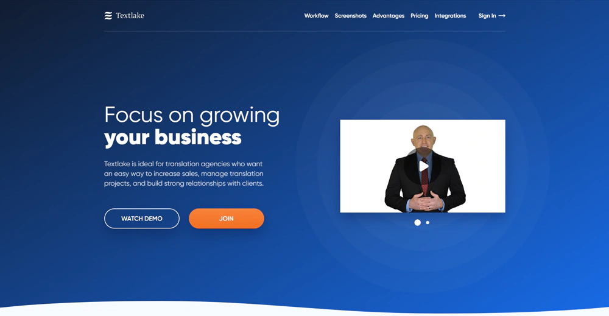


<br>

##  [Textlake CRM](projects/02_textlake-crm) <sup><sub>коммерческий</sub></sup>

📝 Это основной дашборд – [CRM](https://tsm.textlake.com). Именно в нём сотрудники бюро организуют всю свою работу и общаются с заказчиками. Всё разработано с нуля без готовых UI Kits.  
⚙️ **Angular 2-11**, **Angular Animations**, **ngx-translate**, **Lodash**, **Typescript**, **SCSS**, **Webpack**, **AWS Cognito**, **MQTT**, **Stripe**, **Sofort**.  
👀 **[Здесь](https://theberrigan.github.io/demos/textlake-landing/#screenshots)** и **[здесь](https://youtu.be/772IOQsjZwg)** можно посмотреть, как выглядит дашборд внутри.

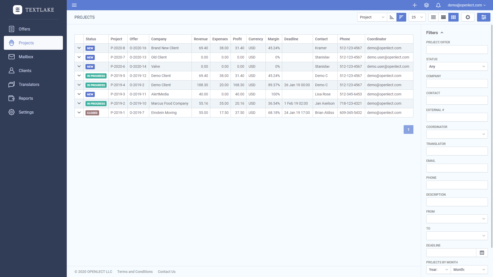


<br>

##  [Textlake Client Dashboard](projects/03_textlake-client-dashboard) <sup><sub>коммерческий</sub></sup>

📝 А это дашборд для клиентов бюро. Там они могут просматривать и оплачивать заказы.  
⚙️ Тот же стек, что и у CRM.  
👀 На скриншоте ниже страница оплаты заказа.

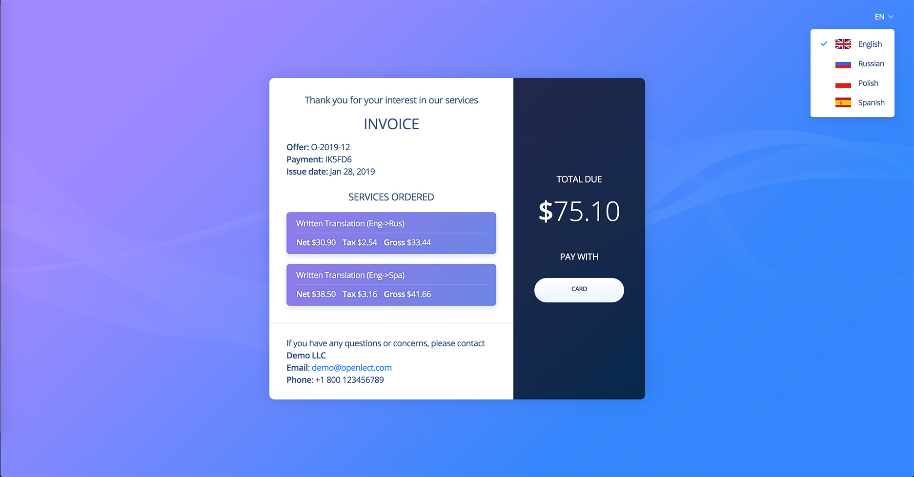


<br>

##  [Лендинг Linguardia](projects/04_textlake-linguardia-landing) <sup><sub>коммерческий</sub></sup>

📝 Лендинг, который я делал для нашего первого клиента – бюро [NSGroup](http://www.nsgroup.info/).  
⚙️ **Angular**, **ngx-translate**, **Typescript**, **SCSS**, **Webpack**.  
👀 **[Здесь](https://theberrigan.github.io/demos/linguardia-landing/)** можно посмотреть демо.

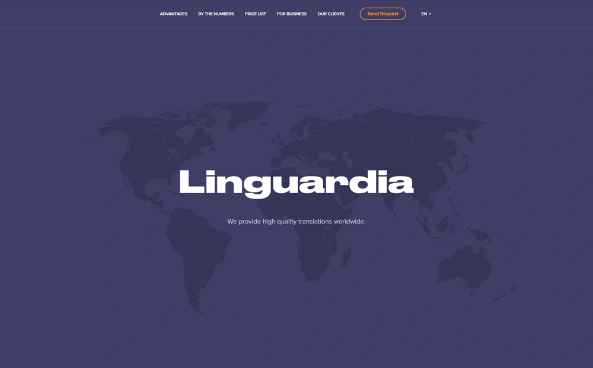


<br>
<br>

**💼 С января 2021 я перешёл в компанию AETolls LLC для работы над её новым продуктом TapNPay – веб-приложением для оплаты проезда по платным дорогам США. Я занимал ту же должность – разработчик фронтенда.**  

**👇 Следующие несколько проектов являются частью этого продукта.**  


<br>

##  [Лендинги Tapnpay](projects/05_tapnpay-landings) <sup><sub>коммерческий</sub></sup>

📝 Два лендинга в одной теме для WordPress. Один общий для продукта, другой – конкретно для Флориды.  
⚙️ **WordPress**, **PHP**, **Typescript**, **SCSS**, **Gulp** + **tsc**.  
👀 **[Демо один](https://theberrigan.github.io/demos/tapnpay-landing/)**, **[демо два](https://theberrigan.github.io/demos/tapnpay-sunpass-landing/)**.

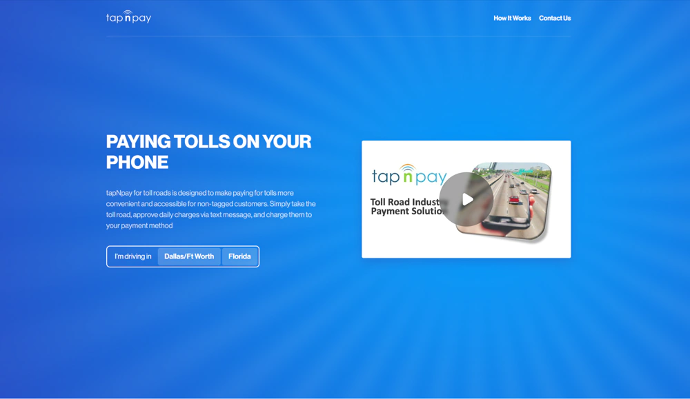


<br>

##  [Tapnpay Client Dashboard](projects/06_tapnpay-client-dashboard) <sup><sub>коммерческий</sub></sup>

📝 Дашборд, в котором пользователи оплачивают проезд.  
⚙️ **Angular 11-17**, **ngx-translate**, **SCSS**, **Typescript**, **Webpack**, **Cypress**, **Jest**, **Stripe**, **Vimeo**, **PayPal**, **Braintree**.  
👀 **[Демо](https://tapnpaydemo.com/auth)**, если удастся зарегистрироваться. **[Здесь](https://disk.yandex.ru/i/OX2HIeMzx6xYoA)** можно посмотреть, как сервис работает на смартфоне. 

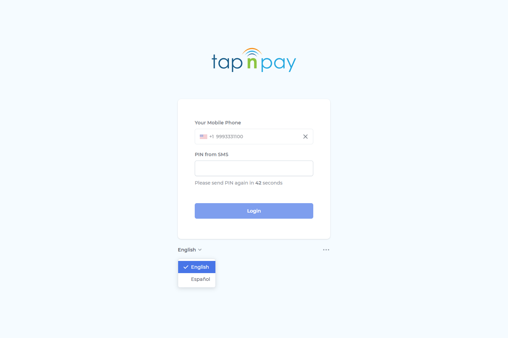


<br>

##  [Tapnpay Admin Dashboard](projects/07_tapnpay-admin-dashboard) <sup><sub>коммерческий</sub></sup>

📝 В этом дашборде администраторы... администрируют 🙂  
⚙️ **Angular 11-14**, в остальном тот же стек.  
👀 К сожалению, демо нет.  


<br>
<br>

**⚔ В 2024 году компанию AETolls LLC поглотил конкурент – NeoRide Inc., а наш проект передали их команде.**


<br>

## 🎯 [Тестовое задание](projects/08_vacancy-test-project) <sup><sub>тестовое</sub></sup>

📝 Тестовое задание от компании с hh: сделать список пользователей с фильтрацией по имени и активности.  
⚙️ **Angular 20**, **Angular Material**, **Signals**, **Vite**, **Less**.  
👀 Внутри есть README с инструкцией, как собрать и запустить проект.  

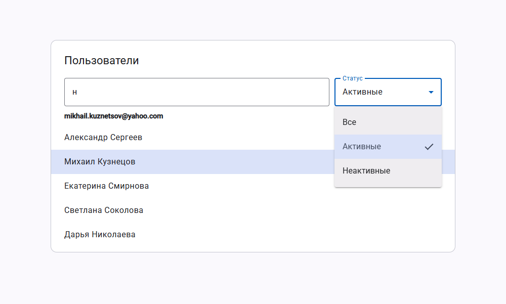


<br>
<br>

**👇 Далее идут несколько расширений для браузера, которые я делал для себя.**


<br>

##  [Chrome Extension Currency Rate](projects/09_chrome-extension-currency-rate) <sup><sub>хобби</sub></sup>

📝 Расширение для Chromium-браузеров, которое отображает текущий курс продажи доллара в [Альфа-Банке](https://alfabank.ru/currency/).  
⚙️ Чистый **JS**, **Chrome Extension API**.  
👀 Подробности внутри. 


<br>

##  [Chrome Extension Steam Tools](projects/10_chrome-extension-steam-tools) <sup><sub>хобби</sub></sup>

📝 Расширение для Chromium-браузеров, которое приводит в порядок сайдбар на странице игры в [Steam](https://store.steampowered.com/) и добавляет туда время прохождения игры из [How Long To Beat](https://howlongtobeat.com/) и [SteamHunters](https://steamhunters.com/).  
⚙️ Чистый **JS**, **Chrome Extension API**.  
👀 Подробности внутри.  

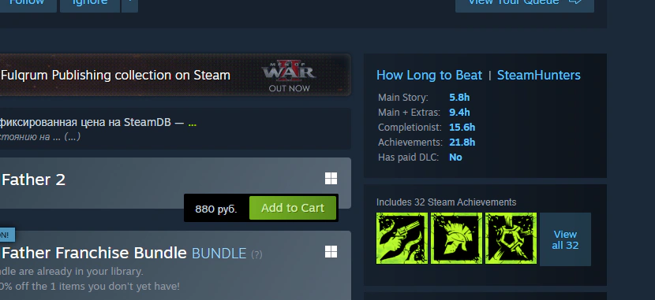


<br>

##  [Chrome Extension Tab Unloader](projects/11_chrome-extension-tab-unloader) <sup><sub>хобби</sub></sup>

📝 Расширение для Chromium-браузеров, которое позволяет вручную выгружать вкладки для экономии ресурсов компьютера.  
⚙️ Чистый **JS**, **Chrome Extension API**.  
👀 Подробности внутри.  


<br>

##  [Chrome Extension Yar Weather](projects/12_chrome-extension-yar-weather) <sup><sub>хобби</sub></sup>

📝 Расширение для Chromium-браузеров, которое отображает текущую температуру воздуха в Ярославле на основе данных из [Gismeteo](https://www.gismeteo.ru/weather-yaroslavl-4313/now/).  
⚙️ Чистый **JS**, **Chrome Extension API**.  
👀 Подробности внутри.  


<br>

##  [Chrome Extension Headhunter Vacancies Watcher](projects/13_chrome-extension-hh-vacancies-watcher) <sup><sub>хобби</sub></sup>

📝 Расширение для Chromium-браузеров, которое каждые несколько минут запрашивает вакансии на [hh.ru](https://hh.ru/) по заданным фильтрам (хардкоднуто в js-файле) и уведомляет о новых.  
⚙️ Чистый **JS**, **Chrome Extension API**.  
👀 Подробности внутри. 


<br>

##  [Fallout Shelter Save Backuper & Editor](projects/14_fallout-shelter-save-backuper-editor) <sup><sub>хобби</sub></sup>

📝 Node.js-скрипт для редактирования и создания резервных копий файлов сохранения игры Fallout Shelter.  
⚙️ Чистый **JS**, **Node.js**, **Web Crypto API**.


<br>

##  [Steam Achievement Manager](projects/15_steam-achievement-manager) <sup><sub>хобби</sub></sup>

📝 Менеджер достижений игрока в играх из Steam.  
⚙️ Чистый **JS**, **Bootstrap 5**, **Python**, **Flask**, **Request**.

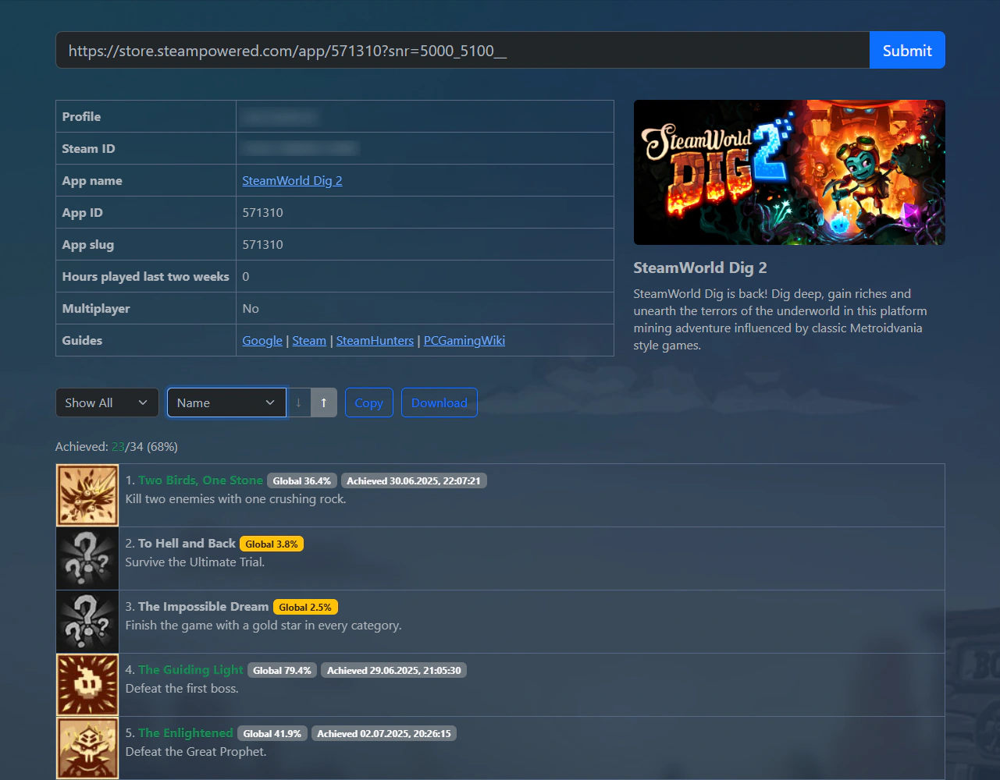


<br>

##  [Карта предметов в GTA San Andreas](projects/16_gta-sa-collectibles-map) <sup><sub>хобби</sub></sup>

📝 Карта коллекционных предметов в GTA San Andreas.  
⚙️ Чистый **JS**, **Python**, **Flask**.  
👀 Подробности внутри.  

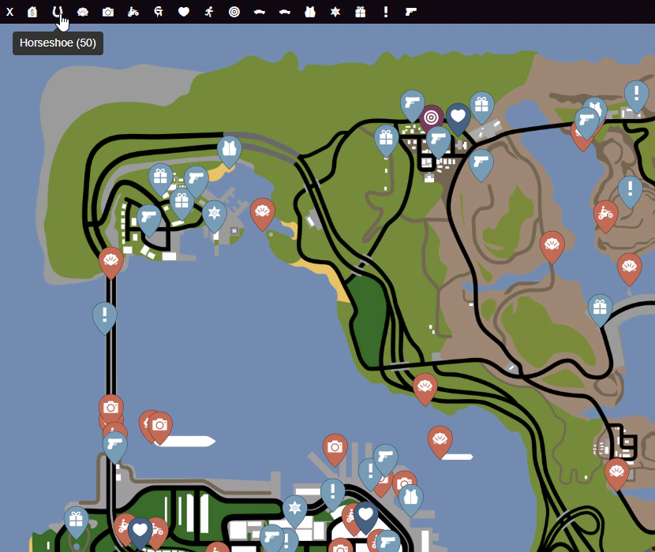


<br>

##  [VK Flex](projects/17_legacy-chrome-extension-vkflex) <sup><sub>хобби</sub></sup>

📝 Это расширение для Chromium-браузеров, которое меняет интерфейс ВК и добавляет новые функции. Я разрабатывал и поддерживал его с 2013 по 2018 год. В 2019 проект выкупили. Оно в портфолио, на случай если работодателю важно моё умение работать с устаревшим кодом.  
⚙️ Чистый **JS**, **jQuery**.  
👀 Новый владелец его забросил, но оно до сих пор доступно в **[Chrome Store](https://chromewebstore.google.com/detail/VK%20Flex/ljbmkjikheoaglnnifnghjbknejbmhap)**.  

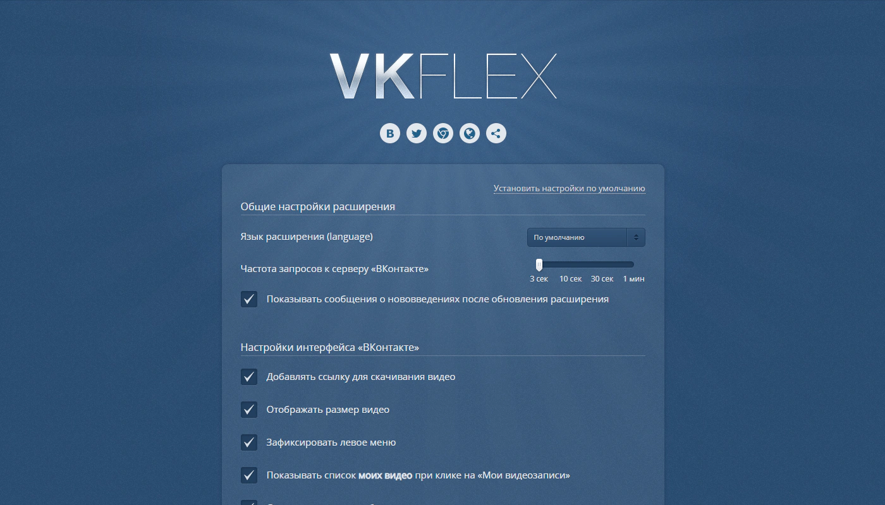


<br>
<br>

**👇 Остальные проекты не связаны с frontend-разработкой. В свободное время я люблю заниматься реверс-инжинирингом компьютерных игр из нулевых. Ниже идут инструменты, разработанные мной для этих целей.**


<br>

##  [Парсер файлов GTA Vice City](projects/18_gta-vc-game-files-parser) <sup><sub>хобби</sub></sup>

📝 Парсер файлов игры GTA Vice City.  
⚙️ **Python 3**.  
👀 Большая часть кода **[здесь](projects/18_gta-vc-game-files-parser/packages/converter/src/vcc/formats)**.


<br>

##  [Парсер файлов Half-Life](projects/19_half-life-game-files-parser) <sup><sub>хобби</sub></sup>

📝 Парсер файлов игры Half-Life.  
⚙️ **Python 3**.  
👀 Большая часть кода **[здесь](projects/19_half-life-game-files-parser/packages/converter/src/hlc/formats)**. 


<br>

## 🛠️ [Data Reverse Engineering Framework](projects/20_data-reverse-engineering-framework) <sup><sub>хобби</sub></sup>

📝 Многофункциональный фреймворк: чтение/запись разных файлов, парсеры форматов, обёртки вокруг DLL-библиотек и EXE-файлов, алгоритмы сжатия данных и т.д.  
⚙️ **Python 3**.


<br>

## 🎮 [Game Tools](projects/21_game-tools) <sup><sub>хобби</sub></sup>

📝 Инструменты для конкретных игр. В основном это распаковщики игровых файлов.  
⚙️ **Python 3**.


<br>

## 🗜️ [Oodle Python Bindings](projects/22_oodle-python-bindings) <sup><sub>хобби</sub></sup>

📝 Python-биндинги для библиотеки сжатия данных Oodle, которая часто используется в современных играх.  
⚙️ **Python 3**.


<br>

##  [Yandex Music Albums Collector](projects/23_yandex-music-albums-collector) <sup><sub>хобби</sub></sup>

📝 Многопоточный сборщик музыкальных альбомов из Яндекс Музыки. Собирает, сжимает и кладёт их в SQLite базу данных.  
⚙️ **Python 3**, **SQLite**.
